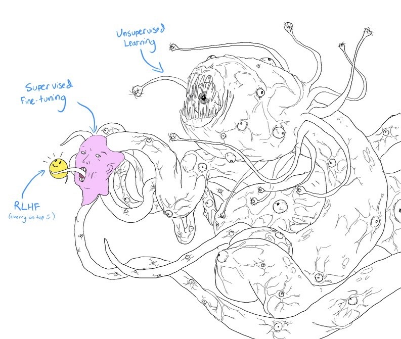

# Awesome-LLM 

🔥 Large Language Models(LLM) have taken the ~~NLP community~~ ~~AI community~~ **the Whole World** by storm. Here is a curated list of papers about large language models, especially relating to ChatGPT. It also contains frameworks for LLM training, tools to deploy LLM, courses and tutorials about LLM and all publicly available LLM checkpoints and APIs.

### ToDos

- Add LLM data (Pretraining data/Instruction Tuning data/Chat data/RLHF data) :sparkles:**Contributions Wanted**

## Table of Content

- [Awesome-LLM ](#awesome-llm-)
  - [Updates](#updates)
  - [Table of Content](#table-of-content)
  - [Milestone Papers](#milestone-papers)
  - [Other Papers](#other-papers)
  - [LLM Leaderboard](#llm-leaderboard)
  - [Open LLM](#open-llm)
  - [LLM Training Frameworks](#llm-training-frameworks)
  - [Tools for deploying LLM](#tools-for-deploying-llm)
  - [Tutorials about LLM](#tutorials-about-llm)
  - [Courses about LLM](#courses-about-llm)
  - [Opinions about LLM](#opinions-about-llm)
  - [Other Awesome Lists](#other-awesome-lists)
  - [Other Useful Resources](#other-useful-resources)
  - [Contributing](#contributing)

## Milestone Papers

|  Date  |       keywords       |    Institute    | Paper                                                                                                                                                                               | Publication |
| :-----: | :------------------: | :--------------: | :---------------------------------------------------------------------------------------------------------------------------------------------------------------------------------- | :---------: |
| 2017-06 |     Transformers     |      Google      | [Attention Is All You Need](https://arxiv.org/pdf/1706.03762.pdf)                                                                                                                      |   NeurIPS    |
| 2018-06 |       GPT 1.0       |      OpenAI      | [Improving Language Understanding by Generative Pre-Training](https://www.cs.ubc.ca/~amuham01/LING530/papers/radford2018improving.pdf)                                                 |            |
| 2018-10 |         BERT         |      Google      | [BERT: Pre-training of Deep Bidirectional Transformers for Language Understanding](https://aclanthology.org/N19-1423.pdf)                                                              |    NAACL      |
| 2019-02 |       GPT 2.0       |      OpenAI      | [Language Models are Unsupervised Multitask Learners](https://d4mucfpksywv.cloudfront.net/better-language-models/language_models_are_unsupervised_multitask_learners.pdf)              |            |
| 2019-09 |     Megatron-LM     |      NVIDIA      | [Megatron-LM: Training Multi-Billion Parameter Language Models Using Model Parallelism](https://arxiv.org/pdf/1909.08053.pdf)                                                          |            |
| 2019-10 |          T5          |      Google      | [Exploring the Limits of Transfer Learning with a Unified Text-to-Text Transformer](https://jmlr.org/papers/v21/20-074.html)                                                           |    JMLR     |
| 2019-10 |          ZeRO          |      Microsoft      | [ZeRO: Memory Optimizations Toward Training Trillion Parameter Models](https://arxiv.org/pdf/1910.02054.pdf)                                                           |    SC     |
| 2020-01 |     Scaling Law     |      OpenAI      | [Scaling Laws for Neural Language Models](https://arxiv.org/pdf/2001.08361.pdf)                                                                                                        ||
| 2020-05 |       GPT 3.0       |      OpenAI      | [Language models are few-shot learners](https://papers.nips.cc/paper/2020/file/1457c0d6bfcb4967418bfb8ac142f64a-Paper.pdf)                                                             |   NeurIPS    |
| 2021-01 | Switch Transformers |      Google      | [Switch Transformers: Scaling to Trillion Parameter Models with Simple and Efficient Sparsity](https://arxiv.org/pdf/2101.03961.pdf)                                                   |    JMLR     |
| 2021-08 |        Codex        |      OpenAI      | [Evaluating Large Language Models Trained on Code](https://arxiv.org/pdf/2107.03374.pdf)                                                                                               ||
| 2021-08 |  Foundation Models  |     Stanford     | [On the Opportunities and Risks of Foundation Models](https://arxiv.org/pdf/2108.07258.pdf)                                                                                            ||
| 2021-09 |         FLAN         |      Google      | [Finetuned Language Models are Zero-Shot Learners](https://openreview.net/forum?id=gEZrGCozdqR)                                                                                        |    ICLR  |
| 2021-10 |         T0         |      HuggingFace et al.      | [Multitask Prompted Training Enables Zero-Shot Task Generalization](https://arxiv.org/abs/2110.08207)                                                                                        |    ICLR  |
| 2021-12 |         GLaM         |      Google      | [GLaM: Efficient Scaling of Language Models with Mixture-of-Experts](https://arxiv.org/pdf/2112.06905.pdf)                                                                             |    ICML  |
| 2021-12 |        WebGPT        |      OpenAI      | [WebGPT: Browser-assisted question-answering with human feedback](https://www.semanticscholar.org/paper/WebGPT%3A-Browser-assisted-question-answering-with-Nakano-Hilton/2f3efe44083af91cef562c1a3451eee2f8601d22)                                                                      ||
| 2021-12 |        Retro        |     DeepMind     | [Improving language models by retrieving from trillions of tokens](https://www.deepmind.com/publications/improving-language-models-by-retrieving-from-trillions-of-tokens)             |    ICML   |
| 2021-12 |        Gopher        |     DeepMind     | [Scaling Language Models: Methods, Analysis &amp; Insights from Training Gopher](https://arxiv.org/pdf/2112.11446.pdf)                                                                 ||
| 2022-01 |         COT         |      Google      | [Chain-of-Thought Prompting Elicits Reasoning in Large Language Models](https://arxiv.org/pdf/2201.11903.pdf)                                                                          |   NeurIPS |
| 2022-01 |        LaMDA        |      Google      | [LaMDA: Language Models for Dialog Applications](https://arxiv.org/pdf/2201.08239.pdf)                                                                                                 ||
| 2022-01 |        Minerva      |      Google      | [Solving Quantitative Reasoning Problems with Language Models](https://arxiv.org/abs/2206.14858)                                                                                                 |   NeurIPS       |
| 2022-01 | Megatron-Turing NLG | Microsoft&NVIDIA | [Using Deep and Megatron to Train Megatron-Turing NLG 530B, A Large-Scale Generative Language Model](https://arxiv.org/pdf/2201.11990.pdf)                                        | |
| 2022-03 |     InstructGPT     |      OpenAI      | [Training language models to follow instructions with human feedback](https://arxiv.org/pdf/2203.02155.pdf)                                                                            ||
| 2022-04 |         PaLM         |      Google      | [PaLM: Scaling Language Modeling with Pathways](https://arxiv.org/pdf/2204.02311.pdf)                                                                                                  ||
| 2022-04 |      Chinchilla      |     DeepMind     | [An empirical analysis of compute-optimal large language model training](https://www.deepmind.com/publications/an-empirical-analysis-of-compute-optimal-large-language-model-training) |   NeurIPS    |
| 2022-05 |         OPT         |       Meta       | [OPT: Open Pre-trained Transformer Language Models](https://arxiv.org/pdf/2205.01068.pdf)                                                                                              ||
| 2022-05 |         UL2         |       Google       | [Unifying Language Learning Paradigms](https://arxiv.org/abs/2205.05131v1)                                                                                              ||
| 2022-06 |  Emergent Abilities  |      Google      | [Emergent Abilities of Large Language Models](https://openreview.net/pdf?id=yzkSU5zdwD)                                                                                                |    TMLR |
| 2022-06 |      BIG-bench      |      Google      | [Beyond the Imitation Game: Quantifying and extrapolating the capabilities of language models](https://github.com/google/BIG-bench)                                                    ||
| 2022-06 |        METALM        |    Microsoft    | [Language Models are General-Purpose Interfaces](https://arxiv.org/pdf/2206.06336.pdf)                                                                                                 |            |
| 2022-09 |       Sparrow       |     DeepMind     | [Improving alignment of dialogue agents via targeted human judgements](https://arxiv.org/pdf/2209.14375.pdf)                                                                           ||
| 2022-10 |       Flan-T5/PaLM       |      Google      | [Scaling Instruction-Finetuned Language Models](https://arxiv.org/pdf/2210.11416.pdf)                                                                                                  ||
| 2022-10 |       GLM-130B       |     Tsinghua     | [GLM-130B: An Open Bilingual Pre-trained Model](https://arxiv.org/pdf/2210.02414.pdf)                                                                                                  |    ICLR  |
| 2022-11 |         HELM         |     Stanford     | [Holistic Evaluation of Language Models](https://arxiv.org/pdf/2211.09110.pdf) ||
| 2022-11 |        BLOOM        |    BigScience    | [BLOOM: A 176B-Parameter Open-Access Multilingual Language Model](https://arxiv.org/pdf/2211.05100.pdf)                                                                                ||
| 2022-11 |      Galactica      |       Meta       | [Galactica: A Large Language Model for Science](https://arxiv.org/pdf/2211.09085.pdf)                                                                                                  ||
| 2022-12 | OPT-IML |  Meta | [OPT-IML: Scaling Language Model Instruction Meta Learning through the Lens of Generalization](https://arxiv.org/pdf/2212.12017)  | |
| 2023-01 | Flan 2022 Collection |      Google      | [The Flan Collection: Designing Data and Methods for Effective Instruction Tuning](https://arxiv.org/pdf/2301.13688.pdf)                                                               ||
| 2023-02 | LLaMA|Meta|[LLaMA: Open and Efficient Foundation Language Models](https://research.facebook.com/publications/llama-open-and-efficient-foundation-language-models/)||
| 2023-02 | Kosmos-1|Microsoft|[Language Is Not All You Need: Aligning Perception with Language Models](https://arxiv.org/abs/2302.14045)||
| 2023-03 | PaLM-E | Google | [PaLM-E: An Embodied Multimodal Language Model](https://palm-e.github.io)||
| 2023-03 | GPT 4 | OpenAI | [GPT-4 Technical Report](https://openai.com/research/gpt-4)||
| 2023-04 | Pythia | EleutherAI et al. | [Pythia: A Suite for Analyzing Large Language Models Across Training and Scaling](https://arxiv.org/abs/2304.01373)|ICML |
| 2023-05 | Dromedary | CMU et al. | [Principle-Driven Self-Alignment of Language Models from Scratch with Minimal Human Supervision](https://arxiv.org/abs/2305.03047)||
| 2023-05 | PaLM 2 | Google | [PaLM 2 Technical Report](https://ai.google/static/documents/palm2techreport.pdf)||
| 2023-05 | RWKV | Bo Peng | [RWKV: Reinventing RNNs for the Transformer Era](https://arxiv.org/abs/2305.13048) ||
| 2023-05 | DPO | Stanford | [Direct Preference Optimization: Your Language Model is Secretly a Reward Model](https://arxiv.org/pdf/2305.18290.pdf) ||
| 2023-07 | LLaMA 2 | Meta | [Llama 2: Open Foundation and Fine-Tuned Chat Models](https://arxiv.org/pdf/2307.09288.pdf) ||

## Other Papers
If you're interested in the field of LLM, you may find the above list of milestone papers helpful to explore its history and state-of-the-art. However, each direction of LLM offers a unique set of insights and contributions, which are essential to understanding the field as a whole. For a detailed list of papers in various subfields, please refer to the following link (it is possible that there are overlaps between different subfields):

(:exclamation: **We would greatly appreciate and welcome your contribution to the following list. :exclamation:**)

- [LLM-Analysis](paper_list/evaluation.md)

  > Analyse different LLMs in different fields with respect to different abilities

- [LLM-Acceleration](paper_list/acceleration.md)

  > Hardware and software acceleration for LLM training and inference

- [LLM-Application](paper_list/application.md)

  > Use LLM to do some really cool stuff

- [LLM-Augmentation](paper_list/augmentation.md)

  > Augment LLM in different aspects including faithfulness, expressiveness, domain-specific knowledge etc.

- [LLM-Detection](paper_list/detection.md)

  > Detect LLM-generated text from texts written by humans

- [LLM-Alignment](paper_list/alignment.md)

  > Align LLM with Human Preference

- [Chain-of-Thought](paper_list/chain_of_thougt.md)

  > Chain of thought—a series of intermediate reasoning steps—significantly improves the ability of large language models to perform complex reasoning.

- [In-Context-Learning](paper_list/in_context_learning.md)

  > Large language models (LLMs) demonstrate an in-context learning (ICL) ability, that is, learning from a few examples in the context.

- [Prompt-Learning](paper_list/prompt_learning.md)

  > A Good Prompt is Worth 1,000 Words

- [Instruction-Tuning](paper_list/instruction-tuning.md)

  > Finetune a language model on a collection of tasks described via instructions

- [Retrieval-Augmented Generation](paper_list/Retrieval_Augmented_Generation.md)

  > Retrieval-Augmented Generation (RAG) combines retrieval from a corpus with generative text models to enhance response accuracy using external knowledge.

## LLM Leaderboard

There are three important steps for a ChatGPT-like LLM: 
1. **Pre-training** 
2. **Instruction Tuning**
3. **Alignment**

The following list makes sure that all LLMs are compared **apples to apples**.
  > You may also find these leaderboards helpful:
  > - [Open LLM Leaderboard](https://huggingface.co/spaces/HuggingFaceH4/open_llm_leaderboard) - aims to track, rank and evaluate LLMs and chatbots as they are released.
  > - [Chatbot Arena Leaderboard](https://huggingface.co/spaces/lmsys/chatbot-arena-leaderboard) - a benchmark platform for large language models (LLMs) that features anonymous, randomized battles in a crowdsourced manner.
  > - [AlpacaEval Leaderboard](https://tatsu-lab.github.io/alpaca_eval/) - An Automatic Evaluator for Instruction-following Language Models
  > - [Open Ko-LLM Leaderboard](https://huggingface.co/spaces/upstage/open-ko-llm-leaderboard) -  The Open Ko-LLM Leaderboard objectively evaluates the performance of Korean Large Language Model (LLM).

### Base LLM

|       Model       | Size |  Architecture  |                                                                                               Access                                                                                               |  Date  | Origin                                                                                                                                       | Model License[^1] |
| :----------------: | :--: | :-------------: | :---------------------------------------------------------------------------------------------------------------------------------------------------------------------------------------------------: | :-----: | -------------------------------------------------------------------------------------------------------------------------------------- | ------------- |
| Switch Transformer | 1.6T |  Decoder(MOE)  |                                                                                                   -                                                                                                   | 2021-01 | [Paper](https://arxiv.org/pdf/2101.03961.pdf)                                                                                           | - |
|        GLaM        | 1.2T |  Decoder(MOE)  |                                                                                                   -                                                                                                   | 2021-12 | [Paper](https://arxiv.org/pdf/2112.06905.pdf)                                                                                           | - |
|        PaLM        | 540B |     Decoder     |                                                                                                   -                                                                                                   | 2022-04 | [Paper](https://arxiv.org/pdf/2204.02311.pdf)                                                                                          | - |
|       MT-NLG       | 530B |     Decoder     |                                                                                                   -                                                                                                   | 2022-01 | [Paper](https://arxiv.org/pdf/2201.11990.pdf)                                                                                          | - |
|      J1-Jumbo      | 178B |     Decoder     |                                                                              [api](https://docs.ai21.com/docs/complete-api)                                                                              | 2021-08 | [Paper](https://uploads-ssl.webflow.com/60fd4503684b466578c0d307/61138924626a6981ee09caf6_jurassic_tech_paper.pdf)                  | - |
|        OPT        | 175B |     Decoder     |                                                  [api](https://opt.alpa.ai) \| [ckpt](https://github.com/facebookresearch/metaseq/tree/main/projects/OPT)                                                  | 2022-05 | [Paper](https://arxiv.org/pdf/2205.01068.pdf)                                                                                      | [OPT-175B License Agreement](https://github.com/facebookresearch/metaseq/blob/edefd4a00c24197486a3989abe28ca4eb3881e59/projects/OPT/MODEL_LICENSE.md) |
|       BLOOM       | 176B |     Decoder     |                                                      [api](https://huggingface.co/bigscience/bloom) \| [ckpt](https://huggingface.co/bigscience/bloom)                                                      | 2022-11 | [Paper](https://arxiv.org/pdf/2211.05100.pdf)                                                                                     | [BigScience RAIL License v1.0](https://huggingface.co/spaces/bigscience/license) |
|      GPT 3.0      | 175B |     Decoder     |                                                                                      [api](https://openai.com/api/)                                                                                      | 2020-05 | [Paper](https://arxiv.org/pdf/2005.14165.pdf)                                                                                        | - |
|       LaMDA       | 137B |     Decoder     |                                                                                                   -                                                                                                   | 2022-01 | [Paper](https://arxiv.org/pdf/2201.08239.pdf)                                                                                           | - |
|        GLM        | 130B |     Decoder     |                                                                                [ckpt](https://github.com/THUDM/GLM-130B)                                                                                | 2022-10 | [Paper](https://arxiv.org/pdf/2210.02414.pdf)                                                                                         | [The GLM-130B License](https://github.com/THUDM/GLM-130B/blob/799837802264eb9577eb9ae12cd4bad0f355d7d6/MODEL_LICENSE) |
|        YaLM        | 100B |     Decoder     |                                                                               [ckpt](https://github.com/yandex/YaLM-100B)                                                                               | 2022-06 | [Blog](https://medium.com/yandex/yandex-publishes-yalm-100b-its-the-largest-gpt-like-neural-network-in-open-source-d1df53d0e9a6)     | [Apache 2.0](https://github.com/yandex/YaLM-100B/blob/14fa94df2ebbbd1864b81f13978f2bf4af270fcb/LICENSE) |
|       LLaMA       |  65B  |      Decoder      |                                                                          [ckpt](https://github.com/facebookresearch/llama)                                                                          | 2022-09 | [Paper](https://research.facebook.com/publications/llama-open-and-efficient-foundation-language-models/)                               | [Non-commercial bespoke license](https://github.com/facebookresearch/llama/blob/main/MODEL_CARD.md) |
|      GPT-NeoX      | 20B |     Decoder     |                                                                              [ckpt](https://github.com/EleutherAI/gpt-neox)                                                                              | 2022-04 | [Paper](https://arxiv.org/pdf/2204.06745.pdf)                                                                                        | [Apache 2.0](https://github.com/EleutherAI/gpt-neox/blob/main/LICENSE) |
|        Falcon        | 40B |    Decoder    | [ckpt](https://huggingface.co/tiiuae/falcon-40b) | 2023-05 | [Homepage](https://falconllm.tii.ae)                                                                                        | [Apache 2.0](https://huggingface.co/tiiuae) |
|        UL2        | 20B |    agnostic    | [ckpt](https://huggingface.co/google/ul2#:~:text=UL2%20is%20a%20unified%20framework%20for%20pretraining%20models,downstream%20fine-tuning%20is%20associated%20with%20specific%20pre-training%20schemes.) | 2022-05 | [Paper](https://arxiv.org/pdf/2205.05131v1.pdf)                                                                                        | [Apache 2.0](https://huggingface.co/google/ul2) |
|    鹏程.盘古α    | 13B |     Decoder     |                                                      [ckpt](https://github.com/huawei-noah/Pretrained-Language-Model/tree/master/PanGu-α#模型下载)                                                      | 2021-04 | [Paper](https://arxiv.org/pdf/2104.12369.pdf)                                                                                             | [Apache 2.0](https://github.com/huawei-noah/Pretrained-Language-Model/blob/4624dbadfe00e871789b509fe10232c77086d1de/PanGu-%CE%B1/LICENSE) |
|         T5         | 11B | Encoder-Decoder |                                                                                  [ckpt](https://huggingface.co/t5-11b)                                                                                  | 2019-10 | [Paper](https://jmlr.org/papers/v21/20-074.html)                                                                                      | [Apache 2.0](https://huggingface.co/t5-11b) |
|      CPM-Bee      | 10B |     Decoder     |                                                                                [api](https://live.openbmb.org/models/bee)                                                                                | 2022-10 | [Paper](https://arxiv.org/pdf/2012.00413.pdf)                                                                                         | - |
|       rwkv-4       |  7B  |      RWKV      |                                                                          [ckpt](https://huggingface.co/BlinkDL/rwkv-4-pile-7b)                                                                          | 2022-09 | [Github](https://github.com/BlinkDL/RWKV-LM)                                                                                          | [Apache 2.0](https://huggingface.co/BlinkDL/rwkv-4-pile-7b) |
|       GPT-J       |  6B  |     Decoder     |                                                                            [ckpt](https://huggingface.co/EleutherAI/gpt-j-6B)                                                                            | 2022-09 | [Github](https://github.com/kingoflolz/mesh-transformer-jax)                                                                         | [Apache 2.0](https://huggingface.co/EleutherAI/gpt-j-6b) |
|      GPT-Neo      | 2.7B |     Decoder     |                                                                              [ckpt](https://github.com/EleutherAI/gpt-neo)                                                                              | 2021-03 | [Github](https://github.com/EleutherAI/gpt-neo)                                                                                       | [MIT](https://github.com/EleutherAI/gpt-neo/blob/23485e3c7940560b3b4cb12e0016012f14d03fc7/LICENSE) |
|      GPT-Neo      | 1.3B |     Decoder     |                                                                              [ckpt](https://github.com/EleutherAI/gpt-neo)                                                                              | 2021-03 | [Github](https://github.com/EleutherAI/gpt-neo)                                                                                       | [MIT](https://github.com/EleutherAI/gpt-neo/blob/23485e3c7940560b3b4cb12e0016012f14d03fc7/LICENSE) |

### Instruction finetuned LLM
|       Model       | Size |  Architecture  |                                                                                               Access                                                                                               |  Date  | Origin                                                                                                                              | Model License[^1] |
| :----------------: | :--: | :-------------: | :---------------------------------------------------------------------------------------------------------------------------------------------------------------------------------------------------: | :-----: | ----------------------------------------------------------------------------------------------------------------------------- | ------------- |
|Flan-PaLM| 540B | Decoder |-|2022-10|[Paper](https://arxiv.org/pdf/2210.11416.pdf)| - |
|BLOOMZ| 176B | Decoder | [ckpt](https://huggingface.co/bigscience/bloomz) |2022-11|[Paper](https://arxiv.org/pdf/2211.01786.pdf)| [BigScience RAIL License v1.0](https://huggingface.co/spaces/bigscience/license) |
| InstructGPT |175B| Decoder | [api](https://platform.openai.com/overview) | 2022-03 | [Paper](https://arxiv.org/pdf/2203.02155.pdf) | - |
|Galactica|120B|Decoder|[ckpt](https://huggingface.co/facebook/galactica-120b)|2022-11| [Paper](https://arxiv.org/pdf/2211.09085.pdf)| [CC-BY-NC-4.0](https://github.com/paperswithcode/galai/blob/3a724f562af1a0c8ff97a096c5fbebe579e2160f/LICENSE-MODEL.md) |
| OpenChatKit| 20B | - |[ckpt](https://github.com/togethercomputer/OpenChatKit)| 2023-3 |-| [Apache 2.0](https://github.com/togethercomputer/OpenChatKit/blob/e64116eb569fcb4e0b993c5fab5716abcb08c7e5/LICENSE) |
| Flan-UL2| 20B  | Decoder | [ckpt](https://github.com/google-research/google-research/tree/master/ul2)|2023-03 | [Blog](https://www.yitay.net/blog/flan-ul2-20b)| [Apache 2.0](https://huggingface.co/google/flan-ul2) |
| Gopher | - | - | - | - | - | - |
| Chinchilla | - | - | - | - |- | - |
|Flan-T5| 11B | Encoder-Decoder |[ckpt](https://github.com/google-research/t5x/blob/main/docs/models.md#flan-t5-checkpoints)|2022-10|[Paper](https://arxiv.org/pdf/2210.11416.pdf)| [Apache 2.0](https://github.com/google-research/t5x/blob/776279bdacd8c5a2d3e8ce0f2e7064bd98e98b47/LICENSE) |
|T0|11B|Encoder-Decoder|[ckpt](https://huggingface.co/bigscience/T0)|2021-10|[Paper](https://arxiv.org/pdf/2110.08207.pdf)| [Apache 2.0](https://huggingface.co/bigscience/T0) |
|Alpaca| 7B|Decoder|[demo](https://crfm.stanford.edu/alpaca/)|2023-03|[Github](https://github.com/tatsu-lab/stanford_alpaca)| [CC BY NC 4.0](https://github.com/tatsu-lab/stanford_alpaca/blob/main/WEIGHT_DIFF_LICENSE) |
|Orca| 13B |Decoder|[ckpt](https://aka.ms/orca-1m)|2023-06|[Paper](https://arxiv.org/pdf/2306.02707)|[Non-commercial bespoke license](https://github.com/facebookresearch/llama/blob/main/MODEL_CARD.md) |

### RLHF LLM
|       Model       | Size |  Architecture  |                                                                                               Access                                                                                               |  Date  | Origin                                                                                                                        |
| :----------------: | :--: | :-------------: | :---------------------------------------------------------------------------------------------------------------------------------------------------------------------------------------------------: | :-----: | ----------------------------------------------------------------------------------------------------------------------------- |
| GPT 4  | - | - | - | 2023-03 | [Blog](https://openai.com/research/gpt-4)|
|      ChatGPT      |  -  |     Decoder     |                                                                                 [demo](https://openai.com/blog/chatgpt/)\|[api](https://share.hsforms.com/1u4goaXwDRKC9-x9IvKno0A4sk30)   | 2022-11 | [Blog](https://openai.com/blog/chatgpt/)      |
| Sparrow  | 70B | - | - | 2022-09 | [Paper](https://arxiv.org/pdf/2209.14375.pdf)|
| Claude  | - | - | [demo](https://poe.com/claude)\|[api](https://www.anthropic.com/earlyaccess) | 2023-03 | [Blog](https://www.anthropic.com/index/introducing-claude) |

The above tables coule be better summarized by this wonderful visualization from this [survey paper](https://arxiv.org/abs/2304.13712):

---

## Open LLM

- [LLaMA](https://ai.facebook.com/blog/large-language-model-llama-meta-ai/) - A foundational, 65-billion-parameter large language model. [LLaMA.cpp](https://github.com/ggerganov/llama.cpp) [Lit-LLaMA](https://github.com/Lightning-AI/lit-llama)
  - [Alpaca](https://crfm.stanford.edu/2023/03/13/alpaca.html) - A model fine-tuned from the LLaMA 7B model on 52K instruction-following demonstrations. [Alpaca.cpp](https://github.com/antimatter15/alpaca.cpp) [Alpaca-LoRA](https://github.com/tloen/alpaca-lora)
  - [Flan-Alpaca](https://github.com/declare-lab/flan-alpaca) - Instruction Tuning from Humans and Machines.
  - [Baize](https://github.com/project-baize/baize-chatbot) - Baize is an open-source chat model trained with [LoRA](https://github.com/microsoft/LoRA). It uses 100k dialogs generated by letting ChatGPT chat with itself. 
  - [Cabrita](https://github.com/22-hours/cabrita) - A portuguese finetuned instruction LLaMA.
  - [Vicuna](https://lmsys.org/blog/2023-03-30-vicuna/) - An Open-Source Chatbot Impressing GPT-4 with 90% ChatGPT Quality. 
  - [Llama-X](https://github.com/AetherCortex/Llama-X) - Open Academic Research on Improving LLaMA to SOTA LLM.
  - [Chinese-Vicuna](https://github.com/Facico/Chinese-Vicuna) - A Chinese Instruction-following LLaMA-based Model.
  - [GPTQ-for-LLaMA](https://github.com/qwopqwop200/GPTQ-for-LLaMa) - 4 bits quantization of [LLaMA](https://arxiv.org/abs/2302.13971) using [GPTQ](https://arxiv.org/abs/2210.17323).
  - [GPT4All](https://github.com/nomic-ai/gpt4all) - Demo, data, and code to train open-source assistant-style large language model based on GPT-J and LLaMa.
  - [Koala](https://bair.berkeley.edu/blog/2023/04/03/koala/) - A Dialogue Model for Academic Research
  - [BELLE](https://github.com/LianjiaTech/BELLE) - Be Everyone's Large Language model Engine
  - [StackLLaMA](https://huggingface.co/blog/stackllama) - A hands-on guide to train LLaMA with RLHF.
  - [RedPajama](https://github.com/togethercomputer/RedPajama-Data) -  An Open Source Recipe to Reproduce LLaMA training dataset.
  - [Chimera](https://github.com/FreedomIntelligence/LLMZoo) - Latin Phoenix.
  - [WizardLM|WizardCoder](https://github.com/nlpxucan/WizardLM)  - Family of instruction-following LLMs powered by Evol-Instruct: WizardLM, WizardCoder.
  - [CaMA](https://github.com/zjunlp/CaMA) - a Chinese-English Bilingual LLaMA Model.
  - [Orca](https://aka.ms/orca-lm) - Microsoft's finetuned LLaMA model that reportedly matches GPT3.5, finetuned against 5M of data, ChatGPT, and GPT4
  - [BayLing](https://github.com/ictnlp/BayLing) - an English/Chinese LLM equipped with advanced language alignment, showing superior capability in English/Chinese generation, instruction following and multi-turn interaction.
  - [UltraLM](https://github.com/thunlp/UltraChat) - Large-scale, Informative, and Diverse Multi-round Chat Models.
  - [Guanaco](https://github.com/artidoro/qlora) - QLoRA tuned LLaMA
- [BLOOM](https://huggingface.co/bigscience/bloom) - BigScience Large Open-science Open-access Multilingual Language Model [BLOOM-LoRA](https://github.com/linhduongtuan/BLOOM-LORA)
  - [BLOOMZ&mT0](https://huggingface.co/bigscience/bloomz) - a family of models capable of following human instructions in dozens of languages zero-shot.
  - [Phoenix](https://github.com/FreedomIntelligence/LLMZoo)
- [T5](https://arxiv.org/abs/1910.10683) - Text-to-Text Transfer Transformer 
  - [T0](https://arxiv.org/abs/2110.08207) - Multitask Prompted Training Enables Zero-Shot Task Generalization
- [OPT](https://arxiv.org/abs/2205.01068) - Open Pre-trained Transformer Language Models.
- [UL2](https://arxiv.org/abs/2205.05131v1) - a unified framework for pretraining models that are universally effective across datasets and setups. 
- [GLM](https://github.com/THUDM/GLM)- GLM is a General Language Model pretrained with an autoregressive blank-filling objective and can be finetuned on various natural language understanding and generation tasks.
  - [ChatGLM-6B](https://github.com/THUDM/ChatGLM-6B) - ChatGLM-6B 是一个开源的、支持中英双语的对话语言模型，基于 [General Language Model (GLM)](https://github.com/THUDM/GLM) 架构，具有 62 亿参数.
  - [ChatGLM2-6B](https://github.com/THUDM/ChatGLM2-6B) - An Open Bilingual Chat LLM | 开源双语对话语言模型
- [RWKV](https://github.com/BlinkDL/RWKV-LM) - Parallelizable RNN with Transformer-level LLM Performance.
  - [ChatRWKV](https://github.com/BlinkDL/ChatRWKV) - ChatRWKV is like ChatGPT but powered by my RWKV (100% RNN) language model.
- [StableLM](https://stability.ai/blog/stability-ai-launches-the-first-of-its-stablelm-suite-of-language-models) - Stability AI Language Models.
- [YaLM](https://medium.com/yandex/yandex-publishes-yalm-100b-its-the-largest-gpt-like-neural-network-in-open-source-d1df53d0e9a6) - a GPT-like neural network for generating and processing text. It can be used freely by developers and researchers from all over the world.
- [GPT-Neo](https://github.com/EleutherAI/gpt-neo) - An implementation of model & data parallel [GPT3](https://arxiv.org/abs/2005.14165)-like models using the [mesh-tensorflow](https://github.com/tensorflow/mesh) library.
- [GPT-J](https://github.com/kingoflolz/mesh-transformer-jax/#gpt-j-6b) - A 6 billion parameter, autoregressive text generation model trained on [The Pile](https://pile.eleuther.ai/).
  - [Dolly](https://www.databricks.com/blog/2023/03/24/hello-dolly-democratizing-magic-chatgpt-open-models.html) - a cheap-to-build LLM that exhibits a surprising degree of the instruction following capabilities exhibited by ChatGPT.
- [Pythia](https://github.com/EleutherAI/pythia) - Interpreting Autoregressive Transformers Across Time and Scale
  - [Dolly 2.0](https://www.databricks.com/blog/2023/04/12/dolly-first-open-commercially-viable-instruction-tuned-llm) - the first open source, instruction-following LLM, fine-tuned on a human-generated instruction dataset licensed for research and commercial use.
- [OpenFlamingo](https://github.com/mlfoundations/open_flamingo) - an open-source reproduction of DeepMind's Flamingo model.
- [Cerebras-GPT](https://www.cerebras.net/blog/cerebras-gpt-a-family-of-open-compute-efficient-large-language-models/) - A Family of Open, Compute-efficient, Large Language Models.
- [GALACTICA](https://github.com/paperswithcode/galai/blob/main/docs/model_card.md) - The GALACTICA models are trained on a large-scale scientific corpus.
  - [GALPACA](https://huggingface.co/GeorgiaTechResearchInstitute/galpaca-30b) - GALACTICA 30B fine-tuned on the Alpaca dataset.
- [Palmyra](https://huggingface.co/Writer/palmyra-base) - Palmyra Base was primarily pre-trained with English text.
- [Camel](https://huggingface.co/Writer/camel-5b-hf) - a state-of-the-art instruction-following large language model designed to deliver exceptional performance and versatility.
- [h2oGPT](https://github.com/h2oai/h2ogpt)
- [PanGu-α](https://openi.org.cn/pangu/) - PanGu-α is a 200B parameter autoregressive pretrained Chinese language model develped by Huawei Noah's Ark Lab, MindSpore Team and Peng Cheng Laboratory.
- [MOSS](https://github.com/OpenLMLab/MOSS) - MOSS是一个支持中英双语和多种插件的开源对话语言模型.
- [Open-Assistant](https://github.com/LAION-AI/Open-Assistant) - a project meant to give everyone access to a great chat based large language model.
  - [HuggingChat](https://huggingface.co/chat/) - Powered by Open Assistant's latest model – the best open source chat model right now and @huggingface Inference API.
- [StarCoder](https://huggingface.co/blog/starcoder) - Hugging Face LLM for Code
- [MPT-7B](https://www.mosaicml.com/blog/mpt-7b) - Open LLM for commercial use by MosaicML
- [Falcon](https://falconllm.tii.ae) - Falcon LLM is a foundational large language model (LLM) with 40 billion parameters trained on one trillion tokens. TII has now released Falcon LLM – a 40B model.
- [XGen](https://github.com/salesforce/xgen) - Salesforce open-source LLMs with 8k sequence length.
- [baichuan-7B](https://github.com/baichuan-inc/baichuan-7B) - baichuan-7B 是由百川智能开发的一个开源可商用的大规模预训练语言模型.
- [Aquila](https://github.com/FlagAI-Open/FlagAI/tree/master/examples/Aquila) - 悟道·天鹰语言大模型是首个具备中英双语知识、支持商用许可协议、国内数据合规需求的开源语言大模型。
- [Mistral](https://mistral.ai/) - Mistral-7B-v0.1 is a small, yet powerful model adaptable to many use-cases including code and 8k sequence length. Apache 2.0 licence.

## LLM Training Frameworks

- [DeepSpeed](https://github.com/microsoft/DeepSpeed) - DeepSpeed is a deep learning optimization library that makes distributed training and inference easy, efficient, and effective.
- [Megatron-DeepSpeed](https://github.com/microsoft/Megatron-DeepSpeed) - DeepSpeed version of NVIDIA's Megatron-LM that adds additional support for several features such as MoE model training, Curriculum Learning, 3D Parallelism, and others. 
- [FairScale](https://fairscale.readthedocs.io/en/latest/what_is_fairscale.html) - FairScale is a PyTorch extension library for high performance and large scale training.
- [Megatron-LM](https://github.com/NVIDIA/Megatron-LM) - Ongoing research training transformer models at scale.
- [Colossal-AI](https://github.com/hpcaitech/ColossalAI) - Making large AI models cheaper, faster, and more accessible.
- [BMTrain](https://github.com/OpenBMB/BMTrain) - Efficient Training for Big Models.
- [Mesh Tensorflow](https://github.com/tensorflow/mesh) - Mesh TensorFlow: Model Parallelism Made Easier.
- [maxtext](https://github.com/google/maxtext) - A simple, performant and scalable Jax LLM!
- [Alpa](https://alpa.ai/index.html) - Alpa is a system for training and serving large-scale neural networks.
- [GPT-NeoX](https://github.com/EleutherAI/gpt-neox) - An implementation of model parallel autoregressive transformers on GPUs, based on the DeepSpeed library.

## Tools for deploying LLM

- [FastChat](https://github.com/lm-sys/FastChat) - A distributed multi-model LLM serving system with web UI and OpenAI-compatible RESTful APIs.
- [SkyPilot](https://github.com/skypilot-org/skypilot) - Run LLMs and batch jobs on any cloud. Get maximum cost savings, highest GPU availability, and managed execution -- all with a simple interface.
- [vLLM](https://github.com/vllm-project/vllm) - A high-throughput and memory-efficient inference and serving engine for LLMs
- [Text Generation Inference](https://github.com/huggingface/text-generation-inference) - A Rust, Python and gRPC server for text generation inference. Used in production at [HuggingFace](https://huggingface.co/) to power LLMs api-inference widgets, HFOIL Licence.
- [Haystack](https://haystack.deepset.ai/) - an open-source NLP framework that allows you to use LLMs and transformer-based models from Hugging Face, OpenAI and Cohere to interact with your own data. 
- [Sidekick](https://github.com/ai-sidekick/sidekick) - Data integration platform for LLMs. 
- [LangChain](https://github.com/hwchase17/langchain) -  Building applications with LLMs through composability
- [Swiss Army Llama](https://github.com/Dicklesworthstone/swiss_army_llama) - Comprehensive set of tools for working with local LLMs for various tasks.
- [LiteChain](https://github.com/rogeriochaves/litechain) - Lightweight alternative to LangChain for composing LLMs 
- [magentic](https://github.com/jackmpcollins/magentic) - Seamlessly integrate LLMs as Python functions
- [wechat-chatgpt](https://github.com/fuergaosi233/wechat-chatgpt) - Use ChatGPT On Wechat via wechaty
- [promptfoo](https://github.com/typpo/promptfoo) - Test your prompts. Evaluate and compare LLM outputs, catch regressions, and improve prompt quality.
- [Agenta](https://github.com/agenta-ai/agenta) -  Easily build, version, evaluate and deploy your LLM-powered apps.
- [Serge](https://github.com/serge-chat/serge) - a chat interface crafted with llama.cpp for running Alpaca models. No API keys, entirely self-hosted!
- [Langroid](https://github.com/langroid/langroid) - Harness LLMs with Multi-Agent Programming
- [Embedchain](https://github.com/embedchain/embedchain) - Framework to create ChatGPT like bots over your dataset.
- [CometLLM](https://github.com/comet-ml/comet-llm) - A 100% opensource LLMOps platform to log, manage, and visualize your LLM prompts and chains. Track prompt templates, prompt variables, prompt duration, token usage, and other metadata. Score prompt outputs and visualize chat history all within a single UI.
- [IntelliServer](https://github.com/intelligentnode/IntelliServer) - simplifies the evaluation of LLMs by providing a unified microservice to access and test multiple AI models.
- [OpenLLM](https://github.com/bentoml/OpenLLM) - Fine-tune, serve, deploy, and monitor any open-source LLMs in production. Used in production at [BentoML](https://bentoml.com/) for LLMs-based applications.
- [DeepSpeed-Mii](https://github.com/microsoft/DeepSpeed-MII) -  MII makes low-latency and high-throughput inference, similar to vLLM powered by DeepSpeed.
- [Text-Embeddings-Inference](https://github.com/huggingface/text-embeddings-inference) - Inference for text-embeddings in Rust, HFOIL Licence.
- [Infinity](https://github.com/michaelfeil/infinity) - Inference for text-embeddings in Python
- [TensorRT-LLM](https://github.com/NVIDIA/TensorRT-LLM) - Nvidia Framework for LLM Inference
## Prompting libraries & tools

- [YiVal](https://github.com/YiVal/YiVal) — Evaluate and Evolve: YiVal is an open-source GenAI-Ops tool for tuning and evaluating prompts, configurations, and model parameters using customizable datasets, evaluation methods, and improvement strategies.
- [Guidance](https://github.com/microsoft/guidance) — A handy looking Python library from Microsoft that uses Handlebars templating to interleave generation, prompting, and logical control.
- [LangChain](https://github.com/hwchase17/langchain) — A popular Python/JavaScript library for chaining sequences of language model prompts.
- [FLAML (A Fast Library for Automated Machine Learning & Tuning)](https://microsoft.github.io/FLAML/docs/Getting-Started/): A Python library for automating selection of models, hyperparameters, and other tunable choices.
- [Chainlit](https://docs.chainlit.io/overview) — A Python library for making chatbot interfaces.
- [Guardrails.ai](https://shreyar.github.io/guardrails/) — A Python library for validating outputs and retrying failures. Still in alpha, so expect sharp edges and bugs.
- [Semantic Kernel](https://github.com/microsoft/semantic-kernel) — A Python/C#/Java library from Microsoft that supports prompt templating, function chaining, vectorized memory, and intelligent planning.
- [Prompttools](https://github.com/hegelai/prompttools) — Open-source Python tools for testing and evaluating models, vector DBs, and prompts.
- [Outlines](https://github.com/normal-computing/outlines) — A Python library that provides a domain-specific language to simplify prompting and constrain generation.
- [Promptify](https://github.com/promptslab/Promptify) — A small Python library for using language models to perform NLP tasks.
- [Scale Spellbook](https://scale.com/spellbook) — A paid product for building, comparing, and shipping language model apps.
- [PromptPerfect](https://promptperfect.jina.ai/prompts) — A paid product for testing and improving prompts.
- [Weights & Biases](https://wandb.ai/site/solutions/llmops) — A paid product for tracking model training and prompt engineering experiments.
- [OpenAI Evals](https://github.com/openai/evals) — An open-source library for evaluating task performance of language models and prompts.
- [LlamaIndex](https://github.com/jerryjliu/llama_index) — A Python library for augmenting LLM apps with data.
- [Arthur Shield](https://www.arthur.ai/get-started) — A paid product for detecting toxicity, hallucination, prompt injection, etc.
- [LMQL](https://lmql.ai) — A programming language for LLM interaction with support for typed prompting, control flow, constraints, and tools.
- [ModelFusion](https://github.com/lgrammel/modelfusion) - A TypeScript library for building apps with LLMs and other ML models (speech-to-text, text-to-speech, image generation).
- [Flappy](https://github.com/pleisto/flappy) — Production-Ready LLM Agent SDK for Every Developer.

## Tutorials about LLM
- [Andrej Karpathy] State of GPT [video](https://build.microsoft.com/en-US/sessions/db3f4859-cd30-4445-a0cd-553c3304f8e2)
- [Hyung Won Chung] Instruction finetuning and RLHF lecture [Youtube](https://www.youtube.com/watch?v=zjrM-MW-0y0)
- [Jason Wei] Scaling, emergence, and reasoning in large language models [Slides](https://docs.google.com/presentation/d/1EUV7W7X_w0BDrscDhPg7lMGzJCkeaPkGCJ3bN8dluXc/edit?pli=1&resourcekey=0-7Nz5A7y8JozyVrnDtcEKJA#slide=id.g16197112905_0_0)
- [Susan Zhang] Open Pretrained Transformers [Youtube](https://www.youtube.com/watch?v=p9IxoSkvZ-M&t=4s)
- [Ameet Deshpande] How Does ChatGPT Work? [Slides](https://docs.google.com/presentation/d/1TTyePrw-p_xxUbi3rbmBI3QQpSsTI1btaQuAUvvNc8w/edit#slide=id.g206fa25c94c_0_24)
- [Yao Fu] 预训练，指令微调，对齐，专业化：论大语言模型能力的来源 [Bilibili](https://www.bilibili.com/video/BV1Qs4y1h7pn/?spm_id_from=333.337.search-card.all.click&vd_source=1e55c5426b48b37e901ff0f78992e33f)
- [Hung-yi Lee] ChatGPT 原理剖析 [Youtube](https://www.youtube.com/watch?v=yiY4nPOzJEg&list=RDCMUC2ggjtuuWvxrHHHiaDH1dlQ&index=2)
- [Jay Mody] GPT in 60 Lines of NumPy [Link](https://jaykmody.com/blog/gpt-from-scratch/)
- [ICML 2022] Welcome to the &#34;Big Model&#34; Era: Techniques and Systems to Train and Serve Bigger Models [Link](https://icml.cc/virtual/2022/tutorial/18440)
- [NeurIPS 2022] Foundational Robustness of Foundation Models [Link](https://nips.cc/virtual/2022/tutorial/55796)
- [Andrej Karpathy] Let's build GPT: from scratch, in code, spelled out. [Video](https://www.youtube.com/watch?v=kCc8FmEb1nY)|[Code](https://github.com/karpathy/ng-video-lecture)
- [DAIR.AI] Prompt Engineering Guide [Link](https://github.com/dair-ai/Prompt-Engineering-Guide)
- [邱锡鹏] 大型语言模型的能力分析与应用 [Slides](resources/大型语言模型的能力分析与应用%20-%2030min.pdf) | [Video](https://www.bilibili.com/video/BV1Xb411X7c3/?buvid=XY2DA82257CC34DECD40B00CAE8AFB7F3B43C&is_story_h5=false&mid=dM1oVipECo22eTYTWkJVVg%3D%3D&p=1&plat_id=116&share_from=ugc&share_medium=android&share_plat=android&share_session_id=c42b6c60-9d22-4c75-90b8-48828e1168af&share_source=WEIXIN&share_tag=s_i&timestamp=1676812375&unique_k=meHB9Xg&up_id=487788801&vd_source=1e55c5426b48b37e901ff0f78992e33f)
- [Philipp Schmid] Fine-tune FLAN-T5 XL/XXL using DeepSpeed & Hugging Face Transformers [Link](https://www.philschmid.de/fine-tune-flan-t5-deepspeed)
- [HuggingFace] Illustrating Reinforcement Learning from Human Feedback (RLHF) [Link](https://huggingface.co/blog/rlhf)
- [HuggingFace] What Makes a Dialog Agent Useful? [Link](https://huggingface.co/blog/dialog-agents)
- [张俊林]通向AGI之路：大型语言模型(LLM)技术精要 [Link](https://zhuanlan.zhihu.com/p/597586623)
- [大师兄]ChatGPT/InstructGPT详解 [Link](https://zhuanlan.zhihu.com/p/590311003)
- [HeptaAI]ChatGPT内核：InstructGPT，基于反馈指令的PPO强化学习 [Link](https://zhuanlan.zhihu.com/p/589747432)
- [Yao Fu] How does GPT Obtain its Ability? Tracing Emergent Abilities of Language Models to their Sources [Link](https://yaofu.notion.site/How-does-GPT-Obtain-its-Ability-Tracing-Emergent-Abilities-of-Language-Models-to-their-Sources-b9a57ac0fcf74f30a1ab9e3e36fa1dc1)
- [Stephen Wolfram] What Is ChatGPT Doing … and Why Does It Work? [Link](https://writings.stephenwolfram.com/2023/02/what-is-chatgpt-doing-and-why-does-it-work/)
- [Jingfeng Yang] Why did all of the public reproduction of GPT-3 fail? [Link](https://jingfengyang.github.io/gpt)
- [Hung-yi Lee] ChatGPT (可能)是怎麼煉成的 - GPT 社會化的過程 [Video](https://www.youtube.com/watch?v=e0aKI2GGZNg)
- [Keyvan Kambakhsh] Pure Rust implementation of a minimal Generative Pretrained Transformer [code](https://github.com/keyvank/femtoGPT)
- [过拟合] llm大模型训练知乎专栏 [Link](https://www.zhihu.com/column/c_1252604770952642560)
- [StatQuest] Sequence-to-Sequence (seq2seq) Encoder-Decoder Neural Networks  [Link](https://www.youtube.com/watch?v=L8HKweZIOmg)
- [StatQuest] Transformer Neural Networks, ChatGPT's foundation [Link](https://www.youtube.com/watch?v=zxQyTK8quyY)
- [StatQuest] Decoder-Only Transformers, ChatGPTs specific Transformer [Link](https://www.youtube.com/watch?v=bQ5BoolX9Ag)

## Courses about LLM

- [DeepLearning.AI] ChatGPT Prompt Engineering for Developers [Homepage](https://www.deeplearning.ai/short-courses/chatgpt-prompt-engineering-for-developers/)
- [Princeton] Understanding Large Language Models [Homepage](https://www.cs.princeton.edu/courses/archive/fall22/cos597G/)
- [OpenBMB] 大模型公开课 [主页](https://www.openbmb.org/community/course)
- [Stanford] CS224N-Lecture 11: Prompting, Instruction Finetuning, and RLHF [Slides](https://web.stanford.edu/class/cs224n/slides/cs224n-2023-lecture11-prompting-rlhf.pdf)
- [Stanford] CS324-Large Language Models [Homepage](https://stanford-cs324.github.io/winter2022/)
- [Stanford] CS25-Transformers United V2 [Homepage](https://web.stanford.edu/class/cs25/)
- [Stanford Webinar] GPT-3 & Beyond [Video](https://www.youtube.com/watch?v=-lnHHWRCDGk)
- [李沐] InstructGPT论文精读 [Bilibili](https://www.bilibili.com/video/BV1hd4y187CR/?spm_id_from=333.337.search-card.all.click&vd_source=1e55c5426b48b37e901ff0f78992e33f) [Youtube](https://www.youtube.com/watch?v=zfIGAwD1jOQ)
- [陳縕儂] OpenAI InstructGPT 從人類回饋中學習 ChatGPT 的前身 [Youtube](https://www.youtube.com/watch?v=ORHv8yKAV2Q)
- [李沐] HELM全面语言模型评测 [Bilibili](https://www.bilibili.com/video/BV1z24y1B7uX/?spm_id_from=333.337.search-card.all.click&vd_source=1e55c5426b48b37e901ff0f78992e33f)
- [李沐] GPT，GPT-2，GPT-3 论文精读 [Bilibili](https://www.bilibili.com/video/BV1AF411b7xQ/?spm_id_from=333.788&vd_source=1e55c5426b48b37e901ff0f78992e33f) [Youtube](https://www.youtube.com/watch?v=t70Bl3w7bxY&list=PLFXJ6jwg0qW-7UM8iUTj3qKqdhbQULP5I&index=18)
- [Aston Zhang] Chain of Thought论文 [Bilibili](https://www.bilibili.com/video/BV1t8411e7Ug/?spm_id_from=333.788&vd_source=1e55c5426b48b37e901ff0f78992e33f) [Youtube](https://www.youtube.com/watch?v=H4J59iG3t5o&list=PLFXJ6jwg0qW-7UM8iUTj3qKqdhbQULP5I&index=29)
- [MIT] Introduction to Data-Centric AI [Homepage](https://dcai.csail.mit.edu)

## Opinions about LLM

- [A Stage Review of Instruction Tuning](https://yaofu.notion.site/June-2023-A-Stage-Review-of-Instruction-Tuning-f59dbfc36e2d4e12a33443bd6b2012c2) [2023-06-29] [Yao Fu]

- [LLM Powered Autonomous Agents](https://lilianweng.github.io/posts/2023-06-23-agent/) [2023-06-23] [Lilian]
- [Why you should work on AI AGENTS!](https://www.youtube.com/watch?v=fqVLjtvWgq8) [2023-06-22] [Andrej Karpathy]

- [Google "We Have No Moat, And Neither Does OpenAI"](https://www.semianalysis.com/p/google-we-have-no-moat-and-neither) [2023-05-05]
- [AI competition statement](https://petergabriel.com/news/ai-competition-statement/) [2023-04-20] [petergabriel]
- [我的大模型世界观](https://mp.weixin.qq.com/s/_ZvyxRpgIA4L4pqfcQtPTQ) [2023-04-23] [陆奇]
- [Prompt Engineering](https://lilianweng.github.io/posts/2023-03-15-prompt-engineering/) [2023-03-15] [Lilian]
- [Noam Chomsky: The False Promise of ChatGPT](https://www.nytimes.com/2023/03/08/opinion/noam-chomsky-chatgpt-ai.html) \[2023-03-08][Noam Chomsky]
- [Is ChatGPT 175 Billion Parameters? Technical Analysis](https://orenleung.super.site/is-chatgpt-175-billion-parameters-technical-analysis) \[2023-03-04][Owen]
- [Towards ChatGPT and Beyond](https://zhuanlan.zhihu.com/p/607637180) \[2023-02-20][知乎][欧泽彬]
- [追赶ChatGPT的难点与平替](https://mp.weixin.qq.com/s/eYmssaPFODjC7xwh1jHydQ) \[2023-02-19][李rumor]
- [对话旷视研究院张祥雨｜ChatGPT的科研价值可能更大](https://zhuanlan.zhihu.com/p/606918875) \[2023-02-16][知乎][旷视科技]
- [关于ChatGPT八个技术问题的猜想](https://zhuanlan.zhihu.com/p/606478660) \[2023-02-15][知乎][张家俊]
- [ChatGPT发展历程、原理、技术架构详解和产业未来](https://zhuanlan.zhihu.com/p/590655677?utm_source=wechat_session&utm_medium=social&utm_oi=714896487502315520&s_r=0) \[2023-02-15][知乎][陈巍谈芯]
- [对ChatGPT的二十点看法](https://zhuanlan.zhihu.com/p/605882945?utm_medium=social&utm_oi=939485757606461440&utm_psn=1609870392121860096&utm_source=wechat_session) \[2023-02-13]\[知乎][熊德意]
- [ChatGPT-所见、所闻、所感](https://zhuanlan.zhihu.com/p/605331104) \[2023-02-11]\[知乎][刘聪NLP]
- [The Next Generation Of Large Language Models ](https://www.notion.so/Awesome-LLM-40c8aa3f2b444ecc82b79ae8bbd2696b) \[2023-02-07][Forbes]
- [Large Language Model Training in 2023](https://research.aimultiple.com/large-language-model-training/) \[2023-02-03][Cem Dilmegani]
- [What Are Large Language Models Used For? ](https://www.notion.so/Awesome-LLM-40c8aa3f2b444ecc82b79ae8bbd2696b) \[2023-01-26][NVIDIA]
- [Large Language Models: A New Moore&#39;s Law ](https://huggingface.co/blog/large-language-models) \[2021-10-26\]\[Huggingface\]

## Other Awesome Lists

- [LLMsPracticalGuide](https://github.com/Mooler0410/LLMsPracticalGuide) - A curated (still actively updated) list of practical guide resources of LLMs
- [Awesome ChatGPT Prompts](https://github.com/f/awesome-chatgpt-prompts) - A collection of prompt examples to be used with the ChatGPT model.
- [awesome-chatgpt-prompts-zh](https://github.com/PlexPt/awesome-chatgpt-prompts-zh) - A Chinese collection of prompt examples to be used with the ChatGPT model.
- [Awesome ChatGPT](https://github.com/humanloop/awesome-chatgpt) - Curated list of resources for ChatGPT and GPT-3 from OpenAI.
- [Chain-of-Thoughts Papers](https://github.com/Timothyxxx/Chain-of-ThoughtsPapers) -  A trend starts from "Chain of Thought Prompting Elicits Reasoning in Large Language Models.
- [Instruction-Tuning-Papers](https://github.com/SinclairCoder/Instruction-Tuning-Papers) - A trend starts from `Natrural-Instruction` (ACL 2022), `FLAN` (ICLR 2022) and `T0` (ICLR 2022).
- [LLM Reading List](https://github.com/crazyofapple/Reading_groups/) - A paper & resource list of large language models.
- [Reasoning using Language Models](https://github.com/atfortes/LM-Reasoning-Papers) - Collection of papers and resources on Reasoning using Language Models.
- [Chain-of-Thought Hub](https://github.com/FranxYao/chain-of-thought-hub) - Measuring LLMs' Reasoning Performance
- [Awesome GPT](https://github.com/formulahendry/awesome-gpt) - A curated list of awesome projects and resources related to GPT, ChatGPT, OpenAI, LLM, and more.
- [Awesome GPT-3](https://github.com/elyase/awesome-gpt3) - a collection of demos and articles about the [OpenAI GPT-3 API](https://openai.com/blog/openai-api/).
- [Awesome LLM Human Preference Datasets](https://github.com/PolisAI/awesome-llm-human-preference-datasets) - a collection of human preference datasets for LLM instruction tuning, RLHF and evaluation.
- [RWKV-howto](https://github.com/Hannibal046/RWKV-howto) - possibly useful materials and tutorial for learning RWKV.
- [ModelEditingPapers](https://github.com/zjunlp/ModelEditingPapers) - A paper & resource list on model editing for large language models.
- [Awesome LLM Security](https://github.com/corca-ai/awesome-llm-security) - A curation of awesome tools, documents and projects about LLM Security.
- [Awesome-Align-LLM-Human](https://github.com/GaryYufei/AlignLLMHumanSurvey) - A collection of papers and resources about aligning large language models (LLMs) with human.
- [Awesome-Code-LLM](https://github.com/huybery/Awesome-Code-LLM) - An awesome and curated list of best code-LLM for research.
- [Awesome-LLM-Compression](https://github.com/HuangOwen/Awesome-LLM-Compression) - Awesome LLM compression research papers and tools.
- [Awesome-LLM-Systems](https://github.com/AmberLJC/LLMSys-PaperList) - Awesome LLM systems research papers.
- [awesome-llm-webapps](https://github.com/snowfort-ai/awesome-llm-webapps) - A collection of open source, actively maintained web apps for LLM applications.
- [awesome-japanese-llm](https://github.com/llm-jp/awesome-japanese-llm) - 日本語LLMまとめ - Overview of Japanese LLMs.
- [Awesome-LLM-Healthcare](https://github.com/mingze-yuan/Awesome-LLM-Healthcare) - The paper list of the review on LLMs in medicine.

## Other Useful Resources

- [Arize-Phoenix](https://phoenix.arize.com/) - Open-source tool for ML observability that runs in your notebook environment. Monitor and fine tune LLM, CV and Tabular Models.
- [Emergent Mind](https://www.emergentmind.com) - The latest AI news, curated & explained by GPT-4.
- [ShareGPT](https://sharegpt.com) - Share your wildest ChatGPT conversations with one click.
- [Major LLMs + Data Availability](https://docs.google.com/spreadsheets/d/1bmpDdLZxvTCleLGVPgzoMTQ0iDP2-7v7QziPrzPdHyM/edit#gid=0)
- [500+ Best AI Tools](https://vaulted-polonium-23c.notion.site/500-Best-AI-Tools-e954b36bf688404ababf74a13f98d126)
- [Cohere Summarize Beta](https://txt.cohere.ai/summarize-beta/) - Introducing Cohere Summarize Beta: A New Endpoint for Text Summarization
- [chatgpt-wrapper](https://github.com/mmabrouk/chatgpt-wrapper) - ChatGPT Wrapper is an open-source unofficial Python API and CLI that lets you interact with ChatGPT.
- [Open-evals](https://github.com/open-evals/evals) - A framework extend openai's [Evals](https://github.com/openai/evals) for different language model.
- [Cursor](https://www.cursor.so) - Write, edit, and chat about your code with a powerful AI.
- [AutoGPT](https://github.com/Significant-Gravitas/Auto-GPT) - an experimental open-source application showcasing the capabilities of the GPT-4 language model. 
- [OpenAGI](https://github.com/agiresearch/OpenAGI) - When LLM Meets Domain Experts.
- [HuggingGPT](https://github.com/microsoft/JARVIS) - Solving AI Tasks with ChatGPT and its Friends in HuggingFace.
- [EasyEdit](https://github.com/zjunlp/EasyEdit) - An easy-to-use framework to edit large language models.
- [chatgpt-shroud](https://github.com/guyShilo/chatgpt-shroud) - A Chrome extension for OpenAI's ChatGPT, enhancing user privacy by enabling easy hiding and unhiding of chat history. Ideal for privacy during screen shares.
## Contributing

This is an active repository and your contributions are always welcome!

I will keep some pull requests open if I'm not sure if they are awesome for LLM, you could vote for them by adding 👍 to them.

---

If you have any question about this opinionated list, do not hesitate to contact me chengxin1998@stu.pku.edu.cn.

[^1]: This is not legal advice. Please contact the original authors of the models for more information.
