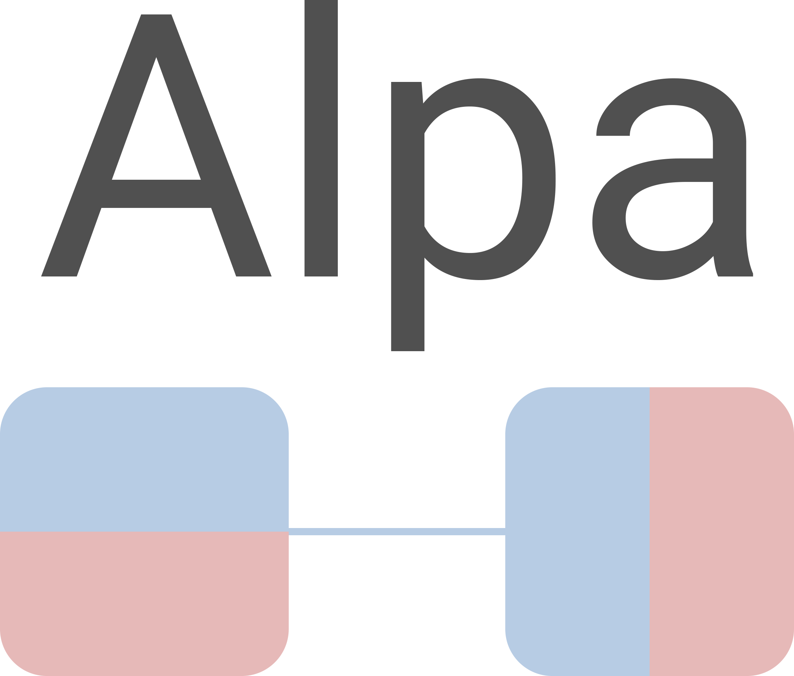
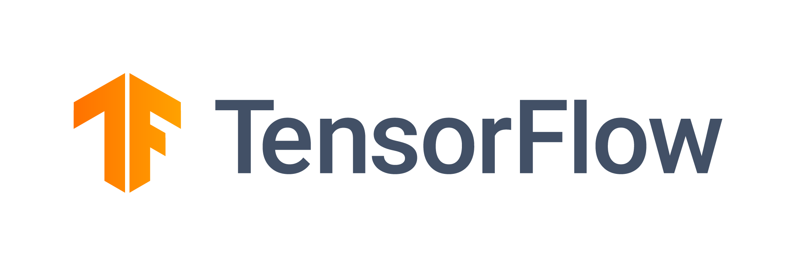

# Awesome-LLM 

🔥 Large Language Models(LLM) have taken the ~~NLP community~~ **the Whole World** by storm. Here is a curated list of papers about large language models, especially relating to ChatGPT. It also contains frameworks for LLM training, tools to deploy LLM, courses and tutorials about LLM and all publicly available LLM checkpoints and APIs:

- [Awesome-LLM ](#awesome-llm-)
  - [Milestone Papers](#milestone-papers)
  - [Other Papers](#other-papers)
  - [LLM Leaderboard](#llm-leaderboard)
  - [LLM Training Frameworks](#llm-training-frameworks)
  - [Tools for deploying LLM](#tools-for-deploying-llm)
  - [Tutorials about LLM](#tutorials-about-llm)
  - [Courses about LLM](#courses-about-llm)
  - [Opinions about LLM](#opinions-about-llm)
  - [Other Awesome Lists](#other-awesome-lists)
  - [Other Useful Resources](#other-useful-resources)
  - [Contributing](#contributing)

## Milestone Papers

|  Date  |       keywords       |    Institute    | Paper                                                                                                                                                                               | Publication |
| :-----: | :------------------: | :--------------: | :---------------------------------------------------------------------------------------------------------------------------------------------------------------------------------- | :---------: |
| 2017-06 |     Transformers     |      Google      | [Attention Is All You Need](https://arxiv.org/pdf/1706.03762.pdf)                                                                                                                      |   NeurIPS   |
| 2018-06 |       GPT 1.0       |      OpenAI      | [Improving Language Understanding by Generative Pre-Training](https://www.cs.ubc.ca/~amuham01/LING530/papers/radford2018improving.pdf)                                                 |            |
| 2018-10 |         BERT         |      Google      | [BERT: Pre-training of Deep Bidirectional Transformers for Language Understanding](https://aclanthology.org/N19-1423.pdf)                                                              |    NAACL    |
| 2019-02 |       GPT 2.0       |      OpenAI      | [Language Models are Unsupervised Multitask Learners](https://d4mucfpksywv.cloudfront.net/better-language-models/language_models_are_unsupervised_multitask_learners.pdf)              |            |
| 2019-09 |     Megatron-LM     |      NVIDIA      | [Megatron-LM: Training Multi-Billion Parameter Language Models Using Model Parallelism](https://arxiv.org/pdf/1909.08053.pdf)                                                          |            |
| 2019-10 |          T5          |      Google      | [Exploring the Limits of Transfer Learning with a Unified Text-to-Text Transformer](https://jmlr.org/papers/v21/20-074.html)                                                           |    JMLR    |
| 2019-10 |          ZeRO          |      Microsoft      | [ZeRO: Memory Optimizations Toward Training Trillion Parameter Models](https://arxiv.org/pdf/1910.02054.pdf)                                                           |    SC    |
| 2020-01 |     Scaling Law     |      OpenAI      | [Scaling Laws for Neural Language Models](https://arxiv.org/pdf/2001.08361.pdf)                                                                                                        |            |
| 2020-05 |       GPT 3.0       |      OpenAI      | [Language models are few-shot learners](https://papers.nips.cc/paper/2020/file/1457c0d6bfcb4967418bfb8ac142f64a-Paper.pdf)                                                             |   NeurIPS   |
| 2021-01 | Switch Transformers |      Google      | [Switch Transformers: Scaling to Trillion Parameter Models with Simple and Efficient Sparsity](https://arxiv.org/pdf/2101.03961.pdf)                                                   |    JMLR    |
| 2021-08 |        Codex        |      OpenAI      | [Evaluating Large Language Models Trained on Code](https://arxiv.org/pdf/2107.03374.pdf)                                                                                               |            |
| 2021-08 |  Foundation Models  |     Stanford     | [On the Opportunities and Risks of Foundation Models](https://arxiv.org/pdf/2108.07258.pdf)                                                                                            |            |
| 2021-09 |         FLAN         |      Google      | [Finetuned Language Models are Zero-Shot Learners](https://openreview.net/forum?id=gEZrGCozdqR)                                                                                        |    ICLR    |
| 2021-10 |         T0         |      HuggingFace et al.      | [Multitask Prompted Training Enables Zero-Shot Task Generalization](https://arxiv.org/abs/2110.08207)                                                                                        |    ICLR    |
| 2021-12 |         GLaM         |      Google      | [GLaM: Efficient Scaling of Language Models with Mixture-of-Experts](https://arxiv.org/pdf/2112.06905.pdf)                                                                             |    ICML    |
| 2021-12 |        WebGPT        |      OpenAI      | [WebGPT: Improving the Factual Accuracy of Language Models through Web Browsing](https://openai.com/blog/webgpt/)                                                                      |            |
| 2021-12 |        Retro        |     DeepMind     | [Improving language models by retrieving from trillions of tokens](https://www.deepmind.com/publications/improving-language-models-by-retrieving-from-trillions-of-tokens)             |    ICML    |
| 2021-12 |        Gopher        |     DeepMind     | [Scaling Language Models: Methods, Analysis &amp; Insights from Training Gopher](https://arxiv.org/pdf/2112.11446.pdf)                                                                 |            |
| 2022-01 |         COT         |      Google      | [Chain-of-Thought Prompting Elicits Reasoning in Large Language Models](https://arxiv.org/pdf/2201.11903.pdf)                                                                          |   NeurIPS   |
| 2022-01 |        LaMDA        |      Google      | [LaMDA: Language Models for Dialog Applications](https://arxiv.org/pdf/2201.08239.pdf)                                                                                                 |            |
| 2022-01 |        Minerva      |      Google      | [Solving Quantitative Reasoning Problems with Language Models](https://arxiv.org/abs/2206.14858)                                                                                                 |   NeurIPS         |
| 2022-01 | Megatron-Turing NLG | Microsoft&NVIDIA | [Using DeepSpeed and Megatron to Train Megatron-Turing NLG 530B, A Large-Scale Generative Language Model](https://arxiv.org/pdf/2201.11990.pdf)                                        |            |
| 2022-03 |     InstructGPT     |      OpenAI      | [Training language models to follow instructions with human feedback](https://arxiv.org/pdf/2203.02155.pdf)                                                                            |            |
| 2022-04 |         PaLM         |      Google      | [PaLM: Scaling Language Modeling with Pathways](https://arxiv.org/pdf/2204.02311.pdf)                                                                                                  |            |
| 2022-04 |      Chinchilla      |     DeepMind     | [An empirical analysis of compute-optimal large language model training](https://www.deepmind.com/publications/an-empirical-analysis-of-compute-optimal-large-language-model-training) |   NeurIPS   |
| 2022-05 |         OPT         |       Meta       | [OPT: Open Pre-trained Transformer Language Models](https://arxiv.org/pdf/2205.01068.pdf)                                                                                              |            |
| 2022-06 |  Emergent Abilities  |      Google      | [Emergent Abilities of Large Language Models](https://openreview.net/pdf?id=yzkSU5zdwD)                                                                                                |    TMLR    |
| 2022-06 |      BIG-bench      |      Google      | [Beyond the Imitation Game: Quantifying and extrapolating the capabilities of language models](https://github.com/google/BIG-bench)                                                    |            |
| 2022-06 |        METALM        |    Microsoft    | [Language Models are General-Purpose Interfaces](https://arxiv.org/pdf/2206.06336.pdf)                                                                                                 |            |
| 2022-09 |       Sparrow       |     DeepMind     | [Improving alignment of dialogue agents via targeted human judgements](https://arxiv.org/pdf/2209.14375.pdf)                                                                           |            |
| 2022-10 |       Flan-T5/PaLM       |      Google      | [Scaling Instruction-Finetuned Language Models](https://arxiv.org/pdf/2210.11416.pdf)                                                                                                  |            |
| 2022-10 |       GLM-130B       |     Tsinghua     | [GLM-130B: An Open Bilingual Pre-trained Model](https://arxiv.org/pdf/2210.02414.pdf)                                                                                                  |    ICLR    |
| 2022-11 |         HELM         |     Stanford     | [Holistic Evaluation of Language Models](https://arxiv.org/pdf/2211.09110.pdf)                                                                                                         |            |
| 2022-11 |        BLOOM        |    BigScience    | [BLOOM: A 176B-Parameter Open-Access Multilingual Language Model](https://arxiv.org/pdf/2211.05100.pdf)                                                                                |            |
| 2022-11 |      Galactica      |       Meta       | [Galactica: A Large Language Model for Science](https://arxiv.org/pdf/2211.09085.pdf)                                                                                                  |            |
| 2023-01 | Flan 2022 Collection |      Google      | [The Flan Collection: Designing Data and Methods for Effective Instruction Tuning](https://arxiv.org/pdf/2301.13688.pdf)                                                               |            |
| 2023-02 | LLaMA|Meta|[LLaMA: Open and Efficient Foundation Language Models](https://research.facebook.com/publications/llama-open-and-efficient-foundation-language-models/)||
| 2023-02 | Kosmos-1|Microsoft|[Language Is Not All You Need: Aligning Perception with Language Models](https://arxiv.org/abs/2302.14045)||
| 2023-03 | PaLM-E | Google | [PaLM-E: An Embodied Multimodal Language Model](https://palm-e.github.io)||
| 2023-03 | GPT 4 | OpenAI | [GPT-4 Technical Report](https://openai.com/research/gpt-4)||

## Other Papers
If you're interested in the field of LLM, you may find the above list of milestone papers helpful to explore its history and state-of-the-art. However, each direction of LLM offers a unique set of insights and contributions, which are essential to understanding the field as a whole. For a detailed list of papers in various subfields, please refer to the following link (it is possible that there are overlaps between different subfields):

(:exclamation: **We would greatly appreciate and welcome your contribution to the following list. :exclamation:**)

- [LLM-Evaluation](paper_list/evaluation.md)

  > Evaluate different LLMs including ChatGPT in different fields

- [LLM-Acceleration](paper_list/acceleration.md)

  > Hardware and software acceleration for LLM training and inference

- [LLM-Application](paper_list/application.md)

  > Use LLM to do some really cool stuff

- [LLM-Augmentation](paper_list/augmentation.md)

  > Augment LLM in different aspects including faithfulness, expressiveness, domain-specific knowledge etc.
  
- [LLM-Detection](paper_list/detection.md)

  > Detect LLM-generated text from texts written by humans

- [Chain-of-Thought](paper_list/chain_of_thougt.md)

  > Chain of thought—a series of intermediate reasoning steps—significantly improves the ability of large language models to perform complex reasoning.

- [In-Context-Learning](paper_list/in_context_learning.md)

  > Large language models (LLMs) demonstrate an in-context learning (ICL) ability, that is, learning from a few examples in the context.

- [RLHF](paper_list/RLHF.md)

  > Reinforcement Learning from Human Preference

- [Prompt-Learning](paper_list/prompt_learning.md)

  > A Good Prompt is Worth 1,000 Words

- [Instruction-Tuning](paper_list/instruction-tuning.md)

  > Finetune a language model on a collection of tasks described via instructions

## LLM Leaderboard

There are three important steps for a ChatGPT-like LLM: 
1. **Pre-training** 
2. **Instruction Tuning**
3. **Alignment**

The following list makes sure that all LLMs are compared **apples to apples**.

### Pre-trained LLM

|       Model       | Size |  Architecture  |                                                                                               Access                                                                                               |  Date  | Origin                                                                                                                        |
| :----------------: | :--: | :-------------: | :---------------------------------------------------------------------------------------------------------------------------------------------------------------------------------------------------: | :-----: | ----------------------------------------------------------------------------------------------------------------------------- |
| Switch Transformer | 1.6T |  Decoder(MOE)  |                                                                                                   -                                                                                                   | 2021-01 | [Paper](https://arxiv.org/pdf/2101.03961.pdf)                                                                                    |
|        GLaM        | 1.2T |  Decoder(MOE)  |                                                                                                   -                                                                                                   | 2021-12 | [Paper](https://arxiv.org/pdf/2112.06905.pdf)                                                                                    |
|        PaLM        | 540B |     Decoder     |                                                                                                   -                                                                                                   | 2022-04 | [Paper](https://arxiv.org/pdf/2204.02311.pdf)                                                                                    |
|       MT-NLG       | 530B |     Decoder     |                                                                                                   -                                                                                                   | 2022-01 | [Paper](https://arxiv.org/pdf/2201.11990.pdf)                                                                                    |
|      J1-Jumbo      | 178B |     Decoder     |                                                                              [api](https://docs.ai21.com/docs/complete-api)                                                                              | 2021-08 | [Paper](https://uploads-ssl.webflow.com/60fd4503684b466578c0d307/61138924626a6981ee09caf6_jurassic_tech_paper.pdf)               |
|        OPT        | 175B |     Decoder     |                                                  [api](https://opt.alpa.ai) \| [ckpt](https://github.com/facebookresearch/metaseq/tree/main/projects/OPT)                                                  | 2022-05 | [Paper](https://arxiv.org/pdf/2205.01068.pdf)                                                                                    |
|       BLOOM       | 176B |     Decoder     |                                                      [api](https://huggingface.co/bigscience/bloom) \| [ckpt](https://huggingface.co/bigscience/bloom)                                                      | 2022-11 | [Paper](https://arxiv.org/pdf/2211.05100.pdf)                                                                                    |
|      GPT 3.0      | 175B |     Decoder     |                                                                                      [api](https://openai.com/api/)                                                                                      | 2020-05 | [Paper](https://arxiv.org/pdf/2005.14165.pdf)                                                                                    |
|       LaMDA       | 137B |     Decoder     |                                                                                                   -                                                                                                   | 2022-01 | [Paper](https://arxiv.org/pdf/2201.08239.pdf)                                                                                    |
|        GLM        | 130B |     Decoder     |                                                                                [ckpt](https://github.com/THUDM/GLM-130B)                                                                                | 2022-10 | [Paper](https://arxiv.org/pdf/2210.02414.pdf)                                                                                    |
|        YaLM        | 100B |     Decoder     |                                                                               [ckpt](https://github.com/yandex/YaLM-100B)                                                                               | 2022-06 | [Blog](https://medium.com/yandex/yandex-publishes-yalm-100b-its-the-largest-gpt-like-neural-network-in-open-source-d1df53d0e9a6) |
|       LLaMA       |  65B  |      Decoder      |                                                                          [ckpt](https://github.com/facebookresearch/llama)                                                                          | 2022-09 | [Paper](https://research.facebook.com/publications/llama-open-and-efficient-foundation-language-models/)                                                                                     |
|      GPT-NeoX      | 20B |     Decoder     |                                                                              [ckpt](https://github.com/EleutherAI/gpt-neox)                                                                              | 2022-04 | [Paper](https://arxiv.org/pdf/2204.06745.pdf)                                                                                    |
|        UL2        | 20B |    agnostic    | [ckpt](https://huggingface.co/google/ul2#:~:text=UL2%20is%20a%20unified%20framework%20for%20pretraining%20models,downstream%20fine-tuning%20is%20associated%20with%20specific%20pre-training%20schemes.) | 2022-05 | [Paper](https://arxiv.org/pdf/2205.05131v1.pdf)                                                                                  |
|    鹏程.盘古α    | 13B |     Decoder     |                                                      [ckpt](https://github.com/huawei-noah/Pretrained-Language-Model/tree/master/PanGu-α#模型下载)                                                      | 2021-04 | [Paper](https://arxiv.org/pdf/2104.12369.pdf)                                                                                    |
|         T5         | 11B | Encoder-Decoder |                                                                                  [ckpt](https://huggingface.co/t5-11b)                                                                                  | 2019-10 | [Paper](https://jmlr.org/papers/v21/20-074.html)                                                                                 |
|      CPM-Bee      | 10B |     Decoder     |                                                                                [api](https://live.openbmb.org/models/bee)                                                                                | 2022-10 | [Paper](https://arxiv.org/pdf/2012.00413.pdf)                                                                                    |
|       rwkv-4       |  7B  |      RWKV      |                                                                          [ckpt](https://huggingface.co/BlinkDL/rwkv-4-pile-7b)                                                                          | 2022-09 | [Github](https://github.com/BlinkDL/RWKV-LM)                                                                                     |
|       GPT-J       |  6B  |     Decoder     |                                                                            [ckpt](https://huggingface.co/EleutherAI/gpt-j-6B)                                                                            | 2022-09 | [Github](https://github.com/kingoflolz/mesh-transformer-jax)                                                                     |
|      GPT-Neo      | 2.7B |     Decoder     |                                                                              [ckpt](https://github.com/EleutherAI/gpt-neo)                                                                              | 2021-03 | [Github](https://github.com/EleutherAI/gpt-neo)                                                                                  |
|      GPT-Neo      | 1.3B |     Decoder     |                                                                              [ckpt](https://github.com/EleutherAI/gpt-neo)                                                                              | 2021-03 | [Github](https://github.com/EleutherAI/gpt-neo)                                                                                  |

### Instruction finetuned LLM
|       Model       | Size |  Architecture  |                                                                                               Access                                                                                               |  Date  | Origin                                                                                                                        |
| :----------------: | :--: | :-------------: | :---------------------------------------------------------------------------------------------------------------------------------------------------------------------------------------------------: | :-----: | ----------------------------------------------------------------------------------------------------------------------------- |
|Flan-PaLM| 540B | Decoder |-|2022-10|[Paper](https://arxiv.org/pdf/2210.11416.pdf)|
|BLOOMZ| 176B | Decoder | [ckpt](https://huggingface.co/bigscience/bloomz) |2022-11|[Paper](https://arxiv.org/pdf/2211.01786.pdf)|
| InstructGPT |175B| Decoder | [api](https://platform.openai.com/overview) | 2022-03 | [Paper](https://arxiv.org/pdf/2203.02155.pdf) |
|Galactica|120B|Decoder|[ckpt](https://huggingface.co/facebook/galactica-120b)|2022-11| [Paper](https://arxiv.org/pdf/2211.09085.pdf)|
| OpenChatKit| 20B | - |[ckpt](https://github.com/togethercomputer/OpenChatKit)| 2023-3 |-|
| Flan-UL2| 20B  | Decoder | [ckpt](https://github.com/google-research/google-research/tree/master/ul2)|2023-03 | [Blog](https://www.yitay.net/blog/flan-ul2-20b)|
| Gopher | - | - | - | - | - |
| Chinchilla | - | - | - | - |- |
|Flan-T5| 11B | Encoder-Decoder |[ckpt](https://github.com/google-research/t5x/blob/main/docs/models.md#flan-t5-checkpoints)|2022-10|[Paper](https://arxiv.org/pdf/2210.11416.pdf)|
|T0|11B|Encoder-Decoder|[ckpt](https://huggingface.co/bigscience/T0)|2021-10|[Paper](https://arxiv.org/pdf/2110.08207.pdf)|
### Aligned LLM
|       Model       | Size |  Architecture  |                                                                                               Access                                                                                               |  Date  | Origin                                                                                                                        |
| :----------------: | :--: | :-------------: | :---------------------------------------------------------------------------------------------------------------------------------------------------------------------------------------------------: | :-----: | ----------------------------------------------------------------------------------------------------------------------------- |
| GPT 4  | - | - | - | 2023-03 | [Blog](https://openai.com/research/gpt-4)|
|      ChatGPT      |  -  |     Decoder     |                                                                                 [demo](https://openai.com/blog/chatgpt/)\|[api](https://share.hsforms.com/1u4goaXwDRKC9-x9IvKno0A4sk30)   | 2022-11 | [Blog](https://openai.com/blog/chatgpt/)      |
| Sparrow  | 70B | - | - | 2022-09 | [Paper](https://arxiv.org/pdf/2209.14375.pdf)|
| Claude  | - | - | - | - | - |

---

## LLM Training Frameworks

> [Serving OPT-175B, BLOOM-176B and CodeGen-16B using Alpa](https://alpa.ai/tutorials/opt_serving.html)

> [Alpa](https://github.com/alpa-projects/alpa) is a system for training and serving large-scale neural networks. Scaling neural networks to hundreds of billions of parameters has enabled dramatic breakthroughs such as GPT-3, but training and serving these large-scale neural networks require complicated distributed system techniques. Alpa aims to automate large-scale distributed training and serving with just a few lines of code.

> [Megatron-LM GPT2 tutorial](https://www.deepspeed.ai/tutorials/megatron/)

> DeepSpeed is an easy-to-use deep learning optimization software suite that enables unprecedented scale and speed for DL Training and Inference. Visit us at [deepspeed.ai](https://www.deepspeed.ai) or our [Github repo](https://github.com/microsoft/DeepSpeed).

> [pretrain_gpt3_175B.sh](https://github.com/NVIDIA/Megatron-LM/blob/main/examples/pretrain_gpt3_175B.sh)

> Megatron-LM could be visited [here](https://github.com/NVIDIA/Megatron-LM). Megatron ([1](https://arxiv.org/pdf/1909.08053.pdf), [2](https://arxiv.org/pdf/2104.04473.pdf), and [3](https://arxiv.org/pdf/2205.05198)) is a large, powerful transformer developed by the Applied Deep Learning Research team at NVIDIA. This repository is for ongoing research on training large transformer language models at scale. We developed efficient, model-parallel ([tensor](https://arxiv.org/pdf/1909.08053.pdf), [sequence](https://arxiv.org/pdf/2205.05198), and [pipeline](https://arxiv.org/pdf/2104.04473.pdf)), and multi-node pre-training of transformer based models such as [GPT](https://arxiv.org/abs/2005.14165), [BERT](https://arxiv.org/pdf/1810.04805.pdf), and [T5](https://arxiv.org/abs/1910.10683) using mixed precision.

> [Open source solution replicates ChatGPT training process! Ready to go with only 1.6GB GPU memory and gives you 7.73 times faster training!](https://www.hpc-ai.tech/blog/colossal-ai-chatgpt)

> [Colossal-AI](https://colossalai.org) provides a collection of parallel components for you. We aim to support you to write your distributed deep learning models just like how you write your model on your laptop. We provide user-friendly tools to kickstart distributed training and inference in a few lines.

> [BMTrain](https://github.com/OpenBMB/BMTrain) is an efficient large model training toolkit that can be used to train large models with tens of billions of parameters. It can train models in a distributed manner while keeping the code as simple as stand-alone training.

> [Mesh TensorFlow `(mtf)`](https://github.com/tensorflow/mesh) is a language for distributed deep learning, capable of specifying a broad class of distributed tensor computations. The purpose of Mesh TensorFlow is to formalize and implement distribution strategies for your computation graph over your hardware/processors. For example: "Split the batch over rows of processors and split the units in the hidden layer across columns of processors." Mesh TensorFlow is implemented as a layer over TensorFlow.

> [This tutorial](https://jax.readthedocs.io/en/latest/notebooks/Distributed_arrays_and_automatic_parallelization.html) discusses parallelism via jax.Array.

## Tools for deploying LLM

🦜️🔗 [LangChain](https://github.com/hwchase17/langchain)

> Large language models (LLMs) are emerging as a transformative technology, enabling developers to build applications that they previously could not. But using these LLMs in isolation is often not enough to create a truly powerful app - the real power comes when you can combine them with other sources of computation or knowledge. This library is aimed at assisting in the development of those types of applications. Common examples of these types of applications include ❓ Question Answering over specific documents, 💬 Chatbots and 🤖 Agents.

👋 [wechat-chatgpt](https://github.com/fuergaosi233/wechat-chatgpt)

> Use ChatGPT On Wechat via wechaty

## Tutorials about LLM
- [Susan Zhang] Open Pretrained Transformers [Youtube](https://www.youtube.com/watch?v=p9IxoSkvZ-M&t=4s)
- [Ameet Deshpande] How Does ChatGPT Work? [Slides](https://docs.google.com/presentation/d/1TTyePrw-p_xxUbi3rbmBI3QQpSsTI1btaQuAUvvNc8w/edit#slide=id.g206fa25c94c_0_24)
- [Yao Fu] 预训练，指令微调，对齐，专业化：论大语言模型能力的来源 [Bilibili](https://www.bilibili.com/video/BV1Qs4y1h7pn/?spm_id_from=333.337.search-card.all.click&vd_source=1e55c5426b48b37e901ff0f78992e33f)
- [Hung-yi Lee] ChatGPT 原理剖析 [Youtube](https://www.youtube.com/watch?v=yiY4nPOzJEg&list=RDCMUC2ggjtuuWvxrHHHiaDH1dlQ&index=2)
- [Jay Mody] GPT in 60 Lines of NumPy [Link](https://jaykmody.com/blog/gpt-from-scratch/)
- [ICML 2022] Welcome to the &#34;Big Model&#34; Era: Techniques and Systems to Train and Serve Bigger Models [Link](https://icml.cc/virtual/2022/tutorial/18440)
- [NeurIPS 2022] Foundational Robustness of Foundation Models [Link](https://nips.cc/virtual/2022/tutorial/55796)
- [Andrej Karpathy] Let's build GPT: from scratch, in code, spelled out. [Video](https://www.youtube.com/watch?v=kCc8FmEb1nY)|[Code](https://github.com/karpathy/ng-video-lecture)
- [DAIR.AI] Prompt Engineering Guide [Link](https://github.com/dair-ai/Prompt-Engineering-Guide)
- [邱锡鹏] 大型语言模型的能力分析与应用 [Slides](resources/大型语言模型的能力分析与应用%20-%2030min.pdf) | [Video](https://www.bilibili.com/video/BV1Xb411X7c3/?buvid=XY2DA82257CC34DECD40B00CAE8AFB7F3B43C&is_story_h5=false&mid=dM1oVipECo22eTYTWkJVVg%3D%3D&p=1&plat_id=116&share_from=ugc&share_medium=android&share_plat=android&share_session_id=c42b6c60-9d22-4c75-90b8-48828e1168af&share_source=WEIXIN&share_tag=s_i&timestamp=1676812375&unique_k=meHB9Xg&up_id=487788801&vd_source=1e55c5426b48b37e901ff0f78992e33f)
- [Philipp Schmid] Fine-tune FLAN-T5 XL/XXL using DeepSpeed & Hugging Face Transformers [Link](https://www.philschmid.de/fine-tune-flan-t5-deepspeed)
- [HuggingFace] Illustrating Reinforcement Learning from Human Feedback (RLHF) [Link](https://huggingface.co/blog/rlhf)
- [HuggingFace] What Makes a Dialog Agent Useful? [Link](https://huggingface.co/blog/dialog-agents)
- [张俊林]通向AGI之路：大型语言模型(LLM)技术精要 [Link](https://zhuanlan.zhihu.com/p/597586623)
- [大师兄]ChatGPT/InstructGPT详解 [Link](https://zhuanlan.zhihu.com/p/590311003)
- [HeptaAI]ChatGPT内核：InstructGPT，基于反馈指令的PPO强化学习 [Link](https://zhuanlan.zhihu.com/p/589747432)
- [Yao Fu] How does GPT Obtain its Ability? Tracing Emergent Abilities of Language Models to their Sources [Link](https://yaofu.notion.site/How-does-GPT-Obtain-its-Ability-Tracing-Emergent-Abilities-of-Language-Models-to-their-Sources-b9a57ac0fcf74f30a1ab9e3e36fa1dc1)
- [Stephen Wolfram] What Is ChatGPT Doing … and Why Does It Work? [Link](https://writings.stephenwolfram.com/2023/02/what-is-chatgpt-doing-and-why-does-it-work/)
- [Jingfeng Yang] Why did all of the public reproduction of GPT-3 fail? [Link](https://jingfengyang.github.io/gpt)
- [Hung-yi Lee] ChatGPT (可能)是怎麼煉成的 - GPT 社會化的過程 [Video](https://www.youtube.com/watch?v=e0aKI2GGZNg)

## Courses about LLM

- [Princeton] Understanding Large Language Models [Homepage](https://www.cs.princeton.edu/courses/archive/fall22/cos597G/)
- [OpenBMB] 大模型公开课 [主页](https://www.openbmb.org/community/course)
- [Stanford] CS224N-Lecture 11: Prompting, Instruction Finetuning, and RLHF [Slides](https://web.stanford.edu/class/cs224n/slides/cs224n-2023-lecture11-prompting-rlhf.pdf)
- [Stanford] CS324-Large Language Models [Homepage](https://stanford-cs324.github.io/winter2022/)
- [Stanford] CS25-Transformers United V2 [Homepage](https://web.stanford.edu/class/cs25/)
- [Stanford Webinar] GPT-3 & Beyond [Video](https://www.youtube.com/watch?v=-lnHHWRCDGk)
- [李沐] InstructGPT论文精读 [Bilibili](https://www.bilibili.com/video/BV1hd4y187CR/?spm_id_from=333.337.search-card.all.click&vd_source=1e55c5426b48b37e901ff0f78992e33f) [Youtube](https://www.youtube.com/watch?v=zfIGAwD1jOQ)
- [陳縕儂] OpenAI InstructGPT 從人類回饋中學習 ChatGPT 的前身 [Youtube](https://www.youtube.com/watch?v=ORHv8yKAV2Q)
- [李沐] HELM全面语言模型评测 [Bilibili](https://www.bilibili.com/video/BV1z24y1B7uX/?spm_id_from=333.337.search-card.all.click&vd_source=1e55c5426b48b37e901ff0f78992e33f)
- [李沐] GPT，GPT-2，GPT-3 论文精读 [Bilibili](https://www.bilibili.com/video/BV1AF411b7xQ/?spm_id_from=333.788&vd_source=1e55c5426b48b37e901ff0f78992e33f) [Youtube](https://www.youtube.com/watch?v=t70Bl3w7bxY&list=PLFXJ6jwg0qW-7UM8iUTj3qKqdhbQULP5I&index=18)
- [Aston Zhang] Chain of Thought论文 [Bilibili](https://www.bilibili.com/video/BV1t8411e7Ug/?spm_id_from=333.788&vd_source=1e55c5426b48b37e901ff0f78992e33f) [Youtube](https://www.youtube.com/watch?v=H4J59iG3t5o&list=PLFXJ6jwg0qW-7UM8iUTj3qKqdhbQULP5I&index=29)
- [MIT] Introduction to Data-Centric AI [Homepage](https://dcai.csail.mit.edu)

## Opinions about LLM
- [Noam Chomsky: The False Promise of ChatGPT](https://www.nytimes.com/2023/03/08/opinion/noam-chomsky-chatgpt-ai.html) \[2023-03-08][Noam Chomsky]
- [Is ChatGPT 175 Billion Parameters? Technical Analysis](https://orenleung.super.site/is-chatgpt-175-billion-parameters-technical-analysis) \[2023-03-04][Owen]
- [Towards ChatGPT and Beyond](https://zhuanlan.zhihu.com/p/607637180) \[2023-02-20][知乎][欧泽彬]
- [追赶ChatGPT的难点与平替](https://mp.weixin.qq.com/s/eYmssaPFODjC7xwh1jHydQ) \[2023-02-19][李rumor]
- [对话旷视研究院张祥雨｜ChatGPT的科研价值可能更大](https://zhuanlan.zhihu.com/p/606918875) \[2023-02-16][知乎][旷视科技]
- [关于ChatGPT八个技术问题的猜想](https://zhuanlan.zhihu.com/p/606478660) \[2023-02-15][知乎][张家俊]
- [ChatGPT发展历程、原理、技术架构详解和产业未来](https://zhuanlan.zhihu.com/p/590655677?utm_source=wechat_session&utm_medium=social&utm_oi=714896487502315520&s_r=0) \[2023-02-15][知乎][陈巍谈芯]
- [对ChatGPT的二十点看法](https://zhuanlan.zhihu.com/p/605882945?utm_medium=social&utm_oi=939485757606461440&utm_psn=1609870392121860096&utm_source=wechat_session) \[2023-02-13]\[知乎][熊德意]
- [ChatGPT-所见、所闻、所感](https://zhuanlan.zhihu.com/p/605331104) \[2023-02-11]\[知乎][刘聪NLP]
- [The Next Generation Of Large Language Models ](https://www.notion.so/Awesome-LLM-40c8aa3f2b444ecc82b79ae8bbd2696b) \[2023-02-07][Forbes]
- [Large Language Model Training in 2023](https://research.aimultiple.com/large-language-model-training/) \[2023-02-03][Cem Dilmegani]
- [What Are Large Language Models Used For? ](https://www.notion.so/Awesome-LLM-40c8aa3f2b444ecc82b79ae8bbd2696b) \[2023-01-26][NVIDIA]
- [Large Language Models: A New Moore&#39;s Law ](https://huggingface.co/blog/large-language-models) \[2021-10-26\]\[Huggingface\]

## Other Awesome Lists

- [Awesome ChatGPT Prompts](https://github.com/f/awesome-chatgpt-prompts) - A collection of prompt examples to be used with the ChatGPT model.
- [awesome-chatgpt-prompts-zh](https://github.com/PlexPt/awesome-chatgpt-prompts-zh) - A Chinese collection of prompt examples to be used with the ChatGPT model.
- [Awesome ChatGPT](https://github.com/humanloop/awesome-chatgpt) - Curated list of resources for ChatGPT and GPT-3 from OpenAI.
- [Chain-of-Thoughts Papers](https://github.com/Timothyxxx/Chain-of-ThoughtsPapers) -  A trend starts from "Chain of Thought Prompting Elicits Reasoning in Large Language Models.
- [LLM Reading List](https://github.com/crazyofapple/Reading_groups/) - A paper & resource list of large language models.
- [Reasoning using Language Models](https://github.com/atfortes/LM-Reasoning-Papers) - Collection of papers and resources on Reasoning using Language Models.

## Other Useful Resources

- [ShareGPT](https://sharegpt.com) - Share your wildest ChatGPT conversations with one click.
- [Major LLMs + Data Availability](https://docs.google.com/spreadsheets/d/1bmpDdLZxvTCleLGVPgzoMTQ0iDP2-7v7QziPrzPdHyM/edit#gid=0)
- [MOSS](https://txsun1997.github.io/blogs/moss.html) - a conversational language model like ChatGPT
- [500+ Best AI Tools](https://vaulted-polonium-23c.notion.site/500-Best-AI-Tools-e954b36bf688404ababf74a13f98d126)
- [Cohere Summarize Beta](https://txt.cohere.ai/summarize-beta/) - Introducing Cohere Summarize Beta: A New Endpoint for Text Summarization
- [chatgpt-wrapper](https://github.com/mmabrouk/chatgpt-wrapper) - ChatGPT Wrapper is an open-source unofficial Python API and CLI that lets you interact with ChatGPT.

## Contributing

This is an active repository and your contributions are always welcome!

I will keep some pull requests open if I'm not sure if they are awesome for LLM, you could vote for them by adding 👍 to them.

---

If you have any question about this opinionated list, do not hesitate to contact me chengxin1998@stu.pku.edu.cn.
